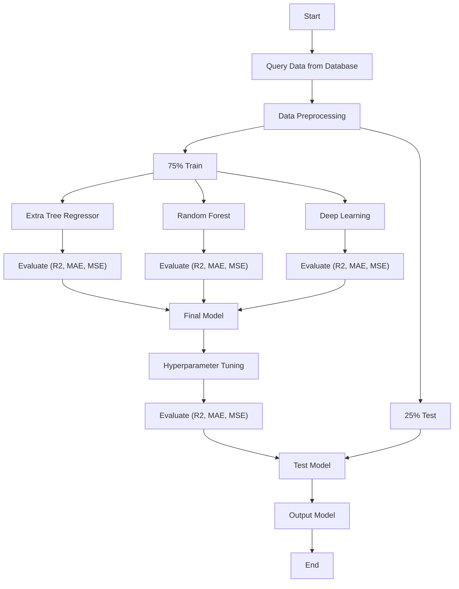

## Project Details: 

1. Team Members:

a. Muhammad Rizaldi Yani H (20924301)

b. Giovaldi Ramadhan (20924303)

c. Aldiansyah Anugrah Ramadhan (20924304)

d. Gia Muhammad Agusta (20924305)

2. Data Source: SDSS Data Release 18
3. Method:

Notes
* Data Preprocessing (filtering zWarning = 0, excluding the 'Star' class, handling outliers, filtering color index, train test split)
* Deep Learning (Deep Convolutional Neural Network)
* Hyperparameter Tuning (Random Search and Genetic Algorithm)
* Output Model (Redshift)

4. ML Category: Supervised Learning (Regression)
5. Estimated Timeline After the first RBL Presentation:

| Activities                | 28 Mei | 29 Mei | 30 Mei | 31 Mei | 1 Jun | 2 Jun | 3 Jun | 4 Jun | 5 Jun | 6 Jun | 7 Jun | 8 Jun | 9 Jun |
|---------------------------|--------|--------|--------|--------|--------|--------|--------|--------|--------|--------|--------|--------|--------|
| Hyperparameter Tuning Model | 🟩     |  🟩    | 🟩     | 🟩     | 🟩     | 🟩     | 🟩     |       |        |        |        |        |        |
| Output Making             |      |        |        |        |        | 🟧     | 🟧     | 🟧     | 🟧     | 🟧     | 🟧     | 🟧     |        |
| Publish Output            |        |      |        |        |        |        |        |        |        |        |        |        | 🟪     |

6. Task Assignments:

a. Medium Story: Rizaldi and Gia

b. YouTube video: All members

c. Git code: Aldiansyah

d. OSF Presentation slides: Giovaldi
